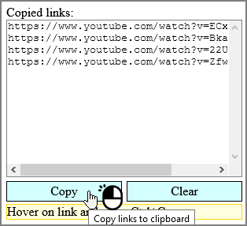
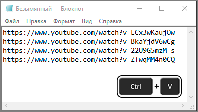

# Fast Copy Links

Firefox addon, copies hovered links on Ctrl+C.

## What it do

Copies hovered links on Ctrl+C

## How to install

Go to addon page and press "Add to Firefox" button, then "Add".

Addon page: <https://addons.mozilla.org/ru/firefox/addon/fast-copy-links/>.

## How to use

Hover on link and press Ctr+C

Hover on other link and press Ctrl+C again

Open menu and copy all links

Paste link list to notepad

